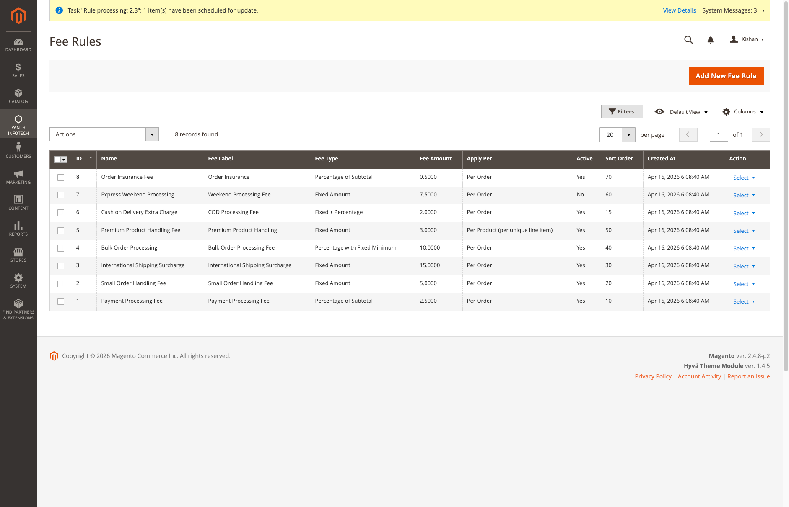
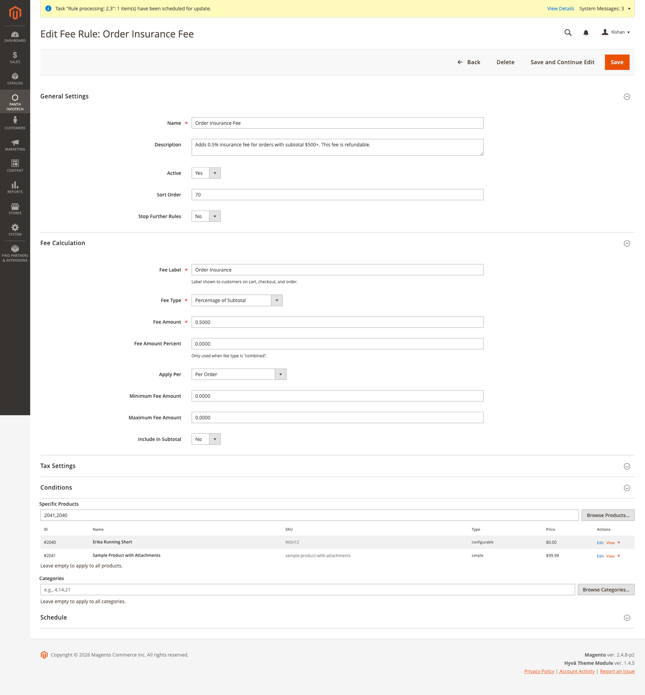
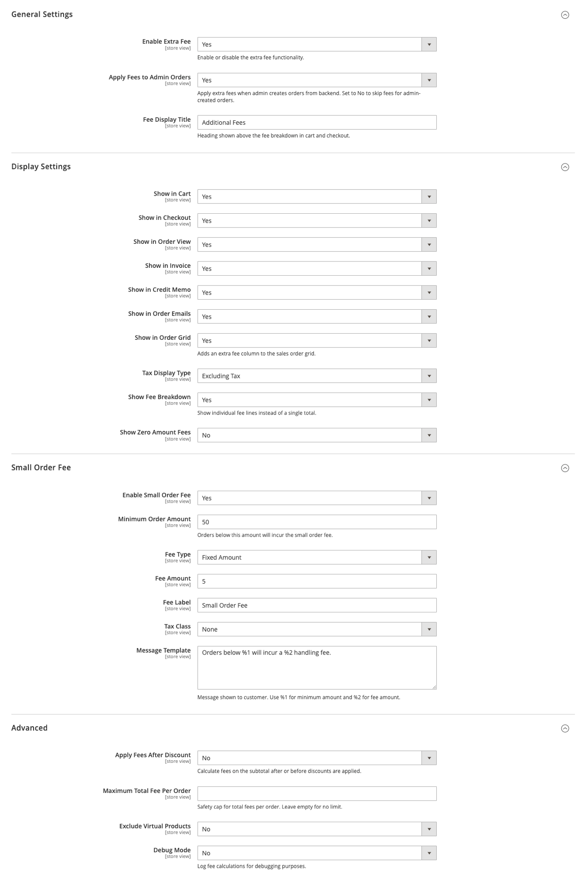
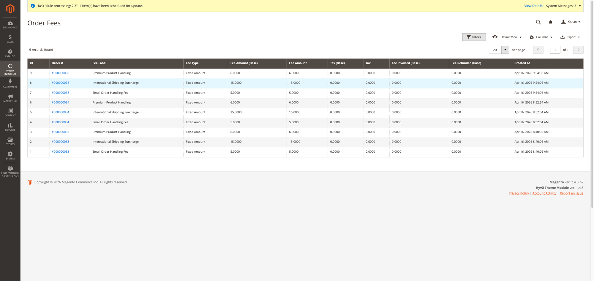
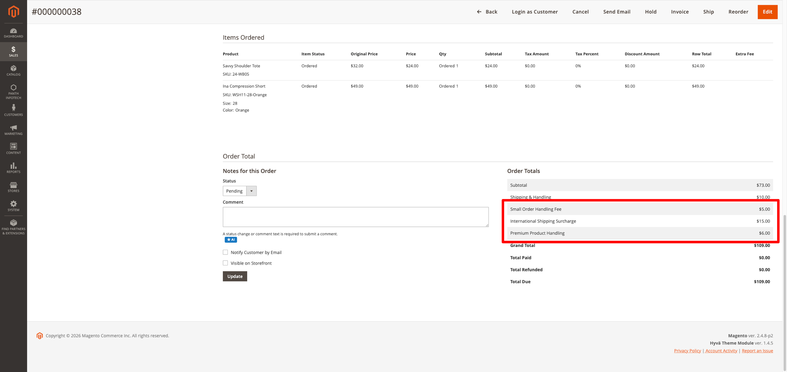
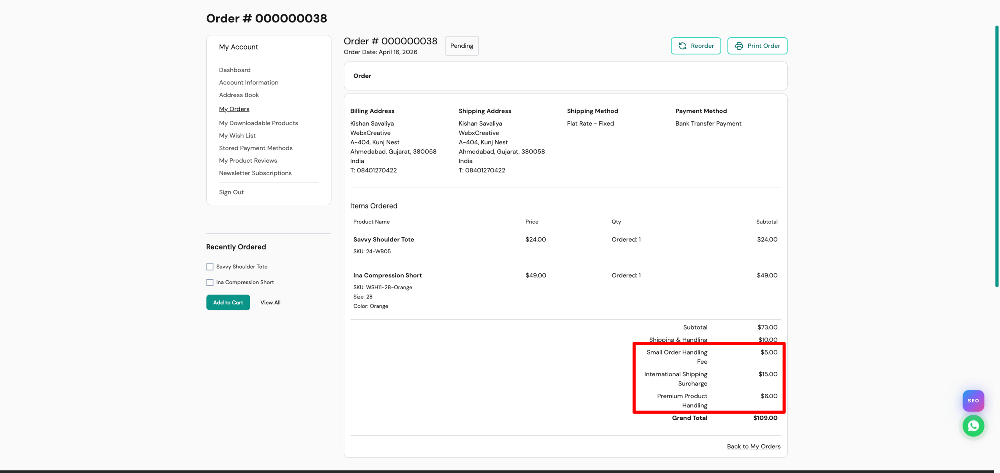
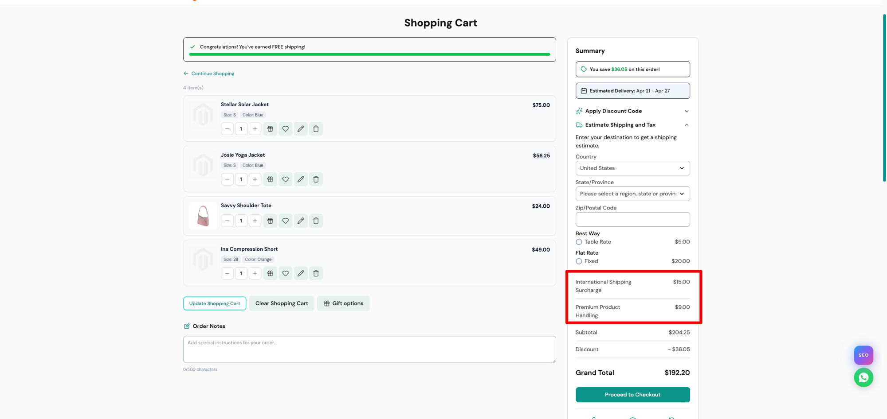
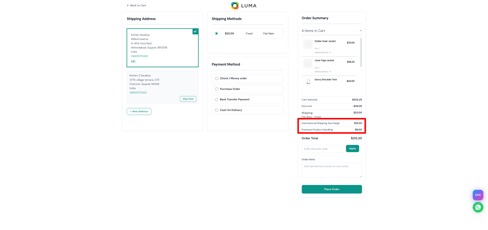

<!-- SEO Meta -->
<!--
  Title: Panth Extra Fee — Configurable Extra Fees & Surcharges for Magento 2 Checkout
  Description: Add extra fees and surcharges to Magento 2 checkout based on payment method, customer group, country, products, categories, order amount, and more. Fixed, percentage, or combined calculation with tax, refund, invoice support. Hyva + Luma compatible.
  Keywords: magento 2 extra fee, magento checkout fee, magento surcharge, magento payment fee, magento order fee, magento extra charges, magento 2 additional fee, magento handling fee, magento small order fee
  Author: Kishan Savaliya (Panth Infotech)
-->

# Panth Extra Fee — Configurable Extra Fees & Surcharges for Magento 2

[](https://github.com/mage2sk/module-extra-fee)
[](https://magento.com)
[](https://php.net)
[]()
[](https://packagist.org/packages/mage2kishan/module-extra-fee)
[](https://www.upwork.com/freelancers/~016dd1767321100e21)
[](https://www.upwork.com/agencies/1881421506131960778/)
[](https://kishansavaliya.com)
[](https://kishansavaliya.com/get-quote)

> **Add configurable extra fees and surcharges to your Magento 2 checkout** — payment method fees, small order fees, customer group surcharges, country-based fees, product-specific handling charges, and more. Each fee shows as its own line item in cart, checkout, order view, invoices, credit memos, and emails. Full tax and refund support built in.

Stop losing margin on small orders, COD payments, and international shipping. **Panth Extra Fee** gives store owners complete control over additional charges with a powerful rule engine, 11 condition types, 4 calculation methods, and a clean admin UI with product/category browse popups.

## Preview

### Fee Rules Management



*Manage all your fee rules from a single grid — filter by type, status, amount, and more.*

### Fee Rule Editor with Product & Category Browse



*Full rule editor with conditions, product/category browse popups, schedule, and tax settings.*

### Admin Configuration



*Granular control: display settings, small order fee, tax display, fee breakdown, and advanced options.*

### Order Fees Tracking



*Track every fee charged — linked to orders with amounts, tax, invoiced, and refunded totals.*

### Admin Order View — Fee Breakdown



*Individual fee lines in Order Totals with per-item Extra Fee column in Items Ordered table.*

### Customer Order View — Frontend



*Customers see fee breakdown in their My Orders page — fully transparent.*

### Cart Page — Fee Line Items



*Each fee shows as its own row in cart totals — works on both Hyva and Luma themes.*

### Luma Checkout — Fee in Order Summary



*Fee lines visible in checkout order summary — updates dynamically based on payment method and address.*

---

## Need Custom Magento 2 Development?

<p align="center">
  <a href="https://kishansavaliya.com/get-quote">
    
  </a>
</p>

<table>
<tr>
<td width="50%" align="center">

### Kishan Savaliya
**Top Rated Plus on Upwork**

[](https://www.upwork.com/freelancers/~016dd1767321100e21)

</td>
<td width="50%" align="center">

### Panth Infotech Agency

[](https://www.upwork.com/agencies/1881421506131960778/)

</td>
</tr>
</table>

---

## Table of Contents

- [Key Features](#key-features)
- [Fee Calculation Types](#fee-calculation-types)
- [Condition Types](#condition-types)
- [Compatibility](#compatibility)
- [Installation](#installation)
- [Configuration](#configuration)
- [Fee Rules](#fee-rules)
- [How It Works](#how-it-works)
- [Where Fees Display](#where-fees-display)
- [Order Fees Grid](#order-fees-grid)
- [Sample Data](#sample-data)
- [Troubleshooting](#troubleshooting)
- [FAQ](#faq)
- [Support](#support)

---

## Key Features

- **Rule-Based Fee Engine** — create unlimited fee rules with conditions and priorities
- **4 Calculation Types** — Fixed, Percentage, Combined (Fixed + Percent), Percentage with Fixed Minimum
- **3 Apply Modes** — Per Order, Per Product (unique line items), Per Quantity (per unit)
- **11 Condition Types** — store, website, date, customer group, payment method, country, subtotal, quantity, product IDs, product SKUs, category IDs
- **Individual Fee Line Items** — each fee shows as its own row in cart/checkout/order (not lumped together)
- **Browse Products & Categories Popup** — visual product/category chooser with search, select all, and selected items preview
- **Tax on Fees** — assign tax class to any fee, 3 display modes (Excl/Incl/Both)
- **Full Invoice & Credit Memo Support** — fees carry to invoices and are refundable
- **Small Order Fee** — config-based fee for orders below minimum with customer-facing message
- **Admin Order Control** — toggle "Apply Fees to Admin Orders" (default: No)
- **Order Fees Grid** — dedicated admin grid tracking all fees with order links, export support
- **Per-Item Fee Column** — "Extra Fee" column in admin order Items Ordered table
- **Sales Order Grid Column** — optional Extra Fee column in the main order grid
- **Multi-Store & Multi-Website** — per-store/website fee rules and configuration
- **Stop Further Rules** — priority-based rule processing with stop flag
- **Fee Breakdown or Aggregated** — show individual fee names or single "Additional Fees" total
- **Email Integration** — fees in order confirmation, invoice, and credit memo emails
- **Hyva + Luma Compatible** — works on both themes, cart and checkout
- **8 Sample Fee Rules** — install via CLI for quick testing
- **MEQP Compliant** — no ObjectManager, strict types, clean DI
- **Zero Frontend Performance Impact** — all calculation server-side

---

## Fee Calculation Types

| Type | Description | Example |
|---|---|---|
| **Fixed Amount** | Flat fee regardless of order value | $5.00 handling fee |
| **Percentage of Subtotal** | Percentage of cart subtotal | 2.5% payment processing fee |
| **Fixed + Percentage** | Both components added together | $2.00 + 1% COD fee |
| **Percentage with Fixed Minimum** | Percentage calculation with a guaranteed minimum | Max(1.5%, $10) bulk processing |

### Apply Modes

| Mode | Description | Example |
|---|---|---|
| **Per Order** | Fee applied once per order | $15 international surcharge |
| **Per Product** | Fee per unique line item matching conditions | $3 per premium product |
| **Per Quantity** | Fee per unit ordered | $0.50 per unit handling |

---

## Condition Types

Every rule can combine multiple conditions — **all must match** for the fee to apply:

| Condition | Description |
|---|---|
| **Store Views** | Apply to specific store views |
| **Websites** | Apply to specific websites |
| **Date Range** | Active only between From/To dates |
| **Customer Groups** | General, Wholesale, Retailer, etc. |
| **Payment Methods** | COD, Bank Transfer, Check/Money Order, etc. |
| **Countries** | Billing/shipping country filter |
| **Min/Max Order Subtotal** | Order value range |
| **Min/Max Order Qty** | Item quantity range |
| **Product IDs** | Specific products (with browse popup) |
| **Category IDs** | Specific categories (with browse popup) |
| **Stop Further Rules** | Skip remaining rules after this one matches |

---

## Compatibility

| Requirement | Versions Supported |
|---|---|
| Magento Open Source | 2.4.4, 2.4.5, 2.4.6, 2.4.7, 2.4.8 |
| Adobe Commerce | 2.4.4, 2.4.5, 2.4.6, 2.4.7, 2.4.8 |
| Adobe Commerce Cloud | 2.4.4 — 2.4.8 |
| PHP | 8.1, 8.2, 8.3, 8.4 |
| Hyva Theme | 1.0+ (fully compatible) |
| Luma Theme | Native support |
| Panth Core | ^1.0 (installed automatically) |

---

## Installation

### Composer (Recommended)

```bash
composer require mage2kishan/module-extra-fee
bin/magento module:enable Panth_Core Panth_ExtraFee
bin/magento setup:upgrade
bin/magento setup:di:compile
bin/magento cache:flush
```

### Install Sample Data (Optional)

```bash
bin/magento panth:extrafee:install-sample-data
```

Creates 8 ready-to-use fee rules for testing.

### Verify

```bash
bin/magento module:status Panth_ExtraFee
# Module is enabled
```

---

## Configuration

Navigate to **Stores > Configuration > Panth Extensions > Extra Fee**.

### General Settings

| Setting | Default | Description |
|---|---|---|
| Enable Extra Fee | Yes | Master toggle |
| Apply Fees to Admin Orders | No | Skip fees when admin creates orders from backend |
| Fee Display Title | Additional Fees | Heading shown above fee lines in totals |

### Display Settings

| Setting | Default | Description |
|---|---|---|
| Show in Cart | Yes | Display fees on cart page |
| Show in Checkout | Yes | Display fees in checkout summary |
| Show in Order View | Yes | Display in customer My Orders |
| Show in Invoice | Yes | Include in invoice totals |
| Show in Credit Memo | Yes | Include in credit memo totals |
| Show in Order Emails | Yes | Include in transactional emails |
| Show in Order Grid | No | Add Extra Fee column to sales order grid |
| Tax Display Type | Excluding Tax | Excl Tax / Incl Tax / Both |
| Show Fee Breakdown | Yes | Individual fee lines vs single total |
| Show Zero Amount Fees | No | Show fees with $0.00 amount |

### Small Order Fee

| Setting | Default | Description |
|---|---|---|
| Enable Small Order Fee | No | Charge fee for orders below minimum |
| Minimum Order Amount | 50 | Threshold amount |
| Fee Type | Fixed | Fixed or Percentage |
| Fee Amount | 5 | Fee amount or percentage |
| Fee Label | Small Order Fee | Label shown to customer |
| Tax Class | None | Tax class for the fee |
| Message Template | Orders below %1... | Customer-facing message |

### Advanced

| Setting | Default | Description |
|---|---|---|
| Apply Fees After Discount | No | Calculate on subtotal before or after discounts |
| Maximum Total Fee Per Order | (empty) | Safety cap on total fees |
| Exclude Virtual Products | No | Skip virtual/downloadable products in calculations |
| Debug Mode | No | Log fee calculations to `var/log/panth_extra_fee.log` |

---

## Fee Rules

Navigate to **Panth Infotech > Extra Fee > Fee Rules**.

### Creating a Fee Rule

1. Click **Add New Fee Rule**
2. **General Settings**: Name, description, active status, sort order, stop further rules
3. **Fee Calculation**: Label, type (fixed/percent/combined/min), amount, apply per (order/product/qty), min/max caps
4. **Tax Settings**: Tax class, refundable toggle
5. **Conditions**: Store views, websites, customer groups, payment methods, countries, subtotal/qty ranges
6. **Product & Category Selection**: Browse popup with search, select all, preview table
7. **Schedule**: Optional from/to dates
8. Click **Save**

### Product & Category Browse Popup

The rule editor includes **"Browse Products..."** and **"Browse Categories..."** buttons that open full-featured popup dialogs:

- **Product popup**: Searchable grid with ID, name, SKU, type, price. Checkbox selection with "Select All" and pills preview.
- **Category popup**: Expandable category tree with checkboxes and level indicators.
- **Selected items table**: Shows selected products/categories below the field with Edit/View/Remove actions.

---

## How It Works

### Checkout Flow

1. Customer adds products to cart
2. **Quote total collector** runs fee calculation engine
3. Engine loads active rules ordered by `sort_order`
4. For each rule: validates all 11 conditions against the quote
5. Matching rules: calculates fee based on type and apply mode
6. Applies min/max fee constraints and global maximum cap
7. Each fee saved to `panth_extra_fee_quote` table
8. **Individual fee segments** returned to cart/checkout for display
9. On order placement: **observer** transfers quote fees to `panth_extra_fee_order`
10. Fees carry through to invoices, credit memos, and emails

### Admin Order Flow

- By default, admin-created orders skip all extra fees
- Toggle "Apply Fees to Admin Orders" to enable
- All fee rules apply identically to frontend orders when enabled

---

## Where Fees Display

| Location | Individual Lines | Aggregated |
|---|---|---|
| Hyva Cart Page | Each fee as separate row | Single "Additional Fees" row |
| Luma Cart Page | Each fee as separate row | Single row |
| Luma Checkout Summary | Each fee with label | Single row |
| Admin Order View — Order Totals | Each fee labeled | Configurable |
| Admin Order View — Items Ordered | Per-item "Extra Fee" column | — |
| Customer My Orders | Each fee in totals | Configurable |
| Order Confirmation Email | Fee breakdown | Configurable |
| Invoice & Credit Memo | Fee lines | Configurable |
| Sales Order Grid | Total extra fee column | Single column |

---

## Order Fees Grid

Navigate to **Panth Infotech > Extra Fee > Order Fees**.

Tracks every fee charged with:

| Column | Description |
|---|---|
| ID | Auto-increment record ID |
| Order # | Clickable link to order (opens in new tab) |
| Fee Label | Rule name shown to customer |
| Fee Type | Fixed, Percent, Combined, etc. |
| Fee Amount (Base/Store) | Charged amount |
| Tax (Base/Store) | Tax calculated on fee |
| Fee Invoiced (Base) | Amount invoiced |
| Fee Refunded (Base) | Amount refunded |
| Created At | Timestamp |

Supports **CSV export** for accounting.

---

## Sample Data

The CLI command creates 8 production-realistic fee rules:

| Rule | Type | Amount | Condition |
|---|---|---|---|
| Payment Processing Fee | 2.5% | Per order | COD, Bank Transfer |
| Small Order Handling Fee | $5 fixed | Per order | Subtotal < $30 |
| International Shipping Surcharge | $15 fixed | Per order | IN, BR, MX, JP, CN |
| Bulk Order Processing | $10 min / 1.5% | Per order | 10+ items, Wholesale group |
| Premium Product Handling | $3 fixed | Per product | Specific categories |
| COD Processing Fee | $2 + 1% | Per order | Cash on Delivery |
| Express Weekend Processing | $7.50 fixed | Per order | Disabled by default |
| Order Insurance Fee | 0.5% | Per order | Subtotal > $500 |

Install: `bin/magento panth:extrafee:install-sample-data`

---

## Troubleshooting

| Issue | Solution |
|---|---|
| Fees not showing in cart | Check: module enabled, rules active, conditions match your cart |
| Fee shows in total but no line item | Clear cache, flush static content, hard-refresh browser |
| Fees not saved to order | Run `setup:di:compile` — observer needs compilation |
| Payment method fee showing without selection | Update to latest — fixed (skips when no method selected) |
| Admin order creation shows fees | Set "Apply Fees to Admin Orders" to No in config |
| Browse Products popup empty | Run `setup:di:compile && cache:flush` |
| Fee amounts wrong | Check rule priority (sort_order) and "Stop Further Rules" settings |
| Fees not in emails | Check Display Settings > Show in Order Emails = Yes |

---

## FAQ

### Can I charge different fees for different payment methods?

Yes. Create separate rules for each payment method. Example: 2.5% for COD, $2 for Bank Transfer.

### Can I charge per product in specific categories?

Yes. Set "Apply Per" to "Per Product" and select categories via "Browse Categories..." popup. Fee multiplied by matching items.

### Can I set a maximum total fee per order?

Yes. In Advanced settings, set "Maximum Total Fee Per Order". If multiple rules total exceeds this cap, fees are proportionally scaled down.

### Are fees refundable?

Configurable per rule. The "Is Refundable" toggle controls whether a fee can be refunded via credit memo.

### Do fees work with discount codes?

Yes. The "Apply Fees After Discount" setting controls whether fees are calculated on the original or discounted subtotal.

### Does it work with Hyva theme?

Yes. Fully compatible with both Hyva and Luma themes — cart page, checkout, order view, and emails.

### Can I skip fees for admin-created orders?

Yes. "Apply Fees to Admin Orders" defaults to No. Admin orders have zero extra fees unless you enable it.

### Can customers see why they're being charged?

Yes. Each fee shows with its label (e.g., "Small Order Handling Fee", "International Shipping Surcharge"). Enable "Show Fee Breakdown" for individual lines.

### Does it slow down checkout?

No. Fee calculation is lightweight — it loads active rules once, evaluates conditions in PHP, and adds totals. No external API calls or complex database queries.

---

## Support

| Channel | Contact |
|---|---|
| Email | kishansavaliyakb@gmail.com |
| Website | [kishansavaliya.com](https://kishansavaliya.com) |
| WhatsApp | +91 84012 70422 |
| GitHub Issues | [github.com/mage2sk/module-extra-fee/issues](https://github.com/mage2sk/module-extra-fee/issues) |
| Upwork (Top Rated Plus) | [Hire Kishan Savaliya](https://www.upwork.com/freelancers/~016dd1767321100e21) |
| Upwork Agency | [Panth Infotech](https://www.upwork.com/agencies/1881421506131960778/) |

### Need Custom Magento Development?

<p align="center">
  <a href="https://kishansavaliya.com/get-quote">
    
  </a>
</p>

---

## License

Proprietary — see `LICENSE.txt`. One license per Magento production installation.

---

## About Panth Infotech

Built and maintained by **Kishan Savaliya** — [kishansavaliya.com](https://kishansavaliya.com) — **Top Rated Plus** Magento developer on Upwork with 10+ years of eCommerce experience.

**Panth Infotech** specializes in high-quality Magento 2 extensions and themes for Hyva and Luma storefronts. Browse our full catalog of 35+ extensions on [Packagist](https://packagist.org/packages/mage2kishan/) and the [Adobe Commerce Marketplace](https://commercemarketplace.adobe.com).

### Quick Links

- [kishansavaliya.com](https://kishansavaliya.com)
- [Get a Quote](https://kishansavaliya.com/get-quote)
- [Upwork Profile](https://www.upwork.com/freelancers/~016dd1767321100e21)
- [Panth Infotech Agency](https://www.upwork.com/agencies/1881421506131960778/)
- [All Packages on Packagist](https://packagist.org/packages/mage2kishan/)
- [GitHub](https://github.com/mage2sk)

---

**SEO Keywords:** magento 2 extra fee, magento checkout surcharge, magento additional charges, magento payment method fee, magento small order fee, magento handling fee, magento country surcharge, magento product fee, magento category fee, magento customer group fee, magento order fee extension, magento 2 extra charges plugin, magento fee rules, magento checkout fee extension, magento 2 surcharge module, panth extra fee, panth infotech, mage2kishan, mage2sk, hire magento developer, top rated plus upwork, magento 2 extension developer, magento 2.4.8 extra fee, hyva extra fee, luma checkout fee
