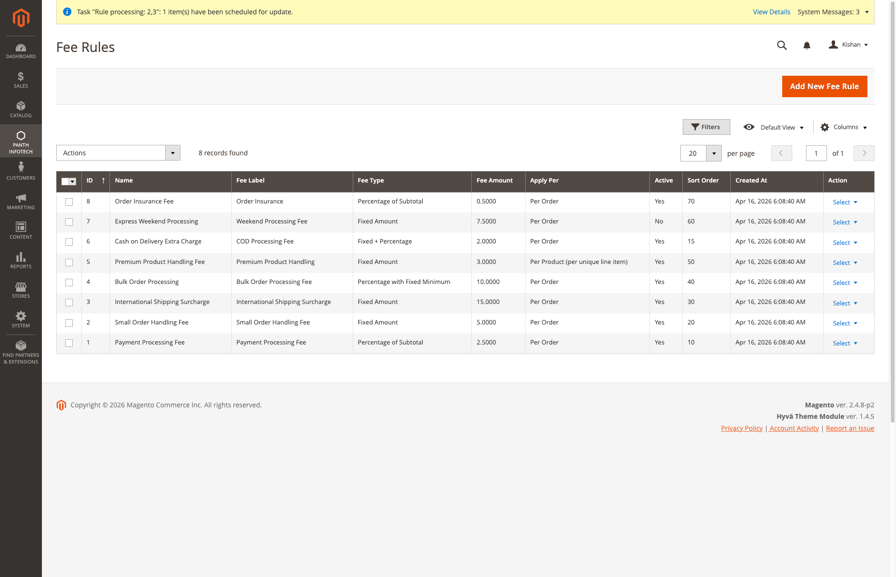
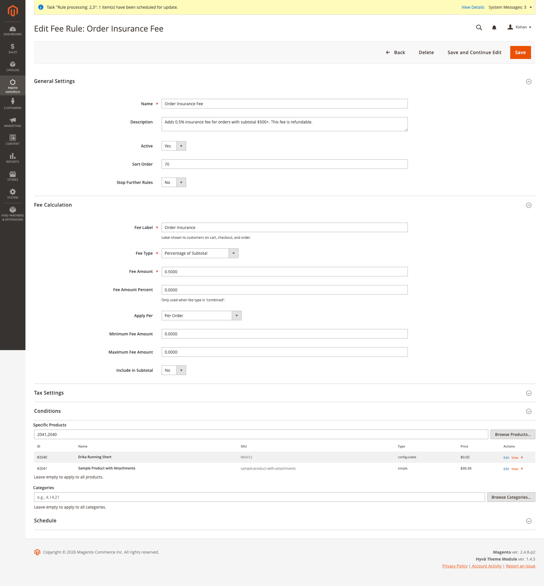
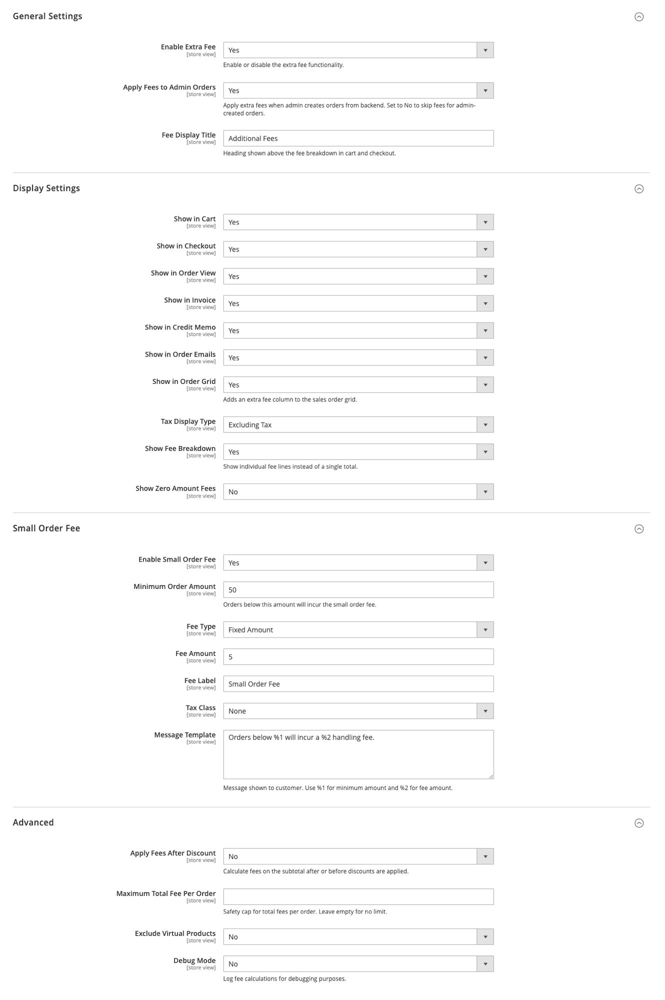
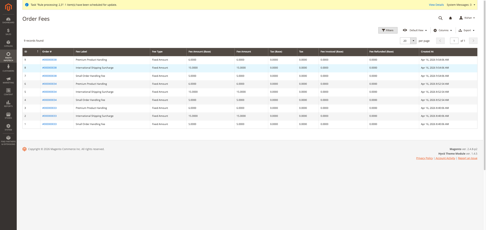
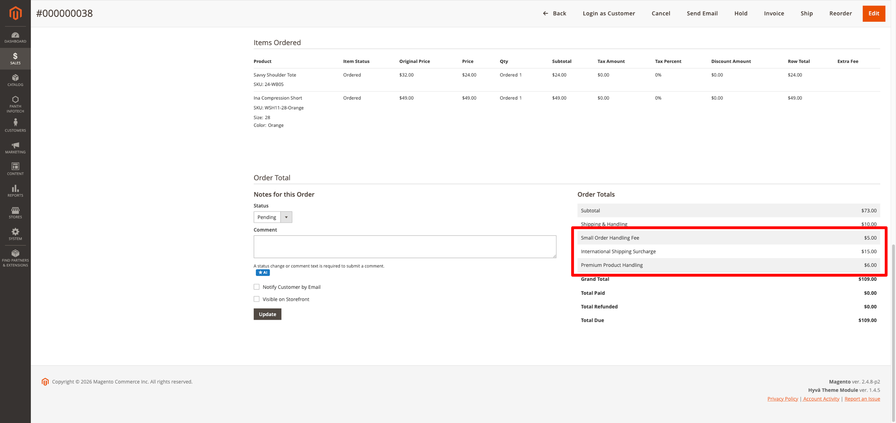
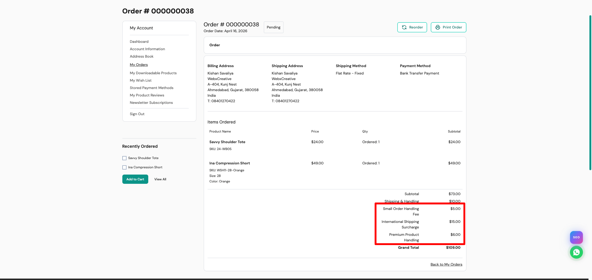
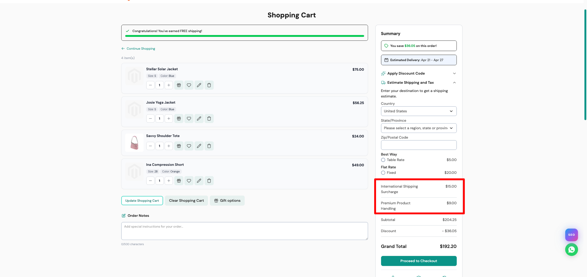
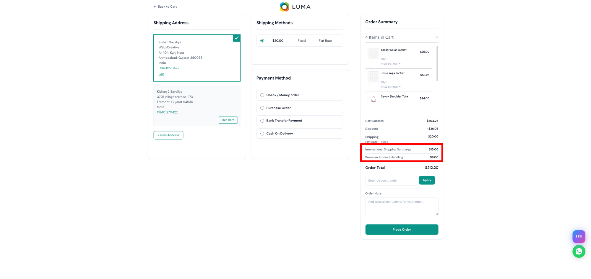

<!-- SEO Meta -->
<!--
  Title: Magento 2 Extra Fee Extension: Configurable Checkout Fees and Surcharges | Hyva + Luma | Panth Infotech
  Description: Add configurable extra fees and surcharges to Magento 2 checkout based on payment method, customer group, country, products, categories, and order amount. Fixed, percentage, or combined calculation with full tax, invoice, and refund support. Hyva + Luma compatible. Built by Top Rated Plus Magento developer Kishan Savaliya.
  Keywords: magento 2 extra fee, magento 2 checkout fee, magento 2 surcharge, magento 2 payment method fee, magento 2 order fee, magento 2 handling fee, magento 2 small order fee, magento 2 additional fee, magento 2 extra charges, hyva extra fee, luma checkout fee, magento 2 extra fee extension
  Author: Kishan Savaliya (Panth Infotech)
  Canonical: https://kishansavaliya.com/magento-2-extra-fee.html
-->

# Magento 2 Extra Fee Extension: Configurable Checkout Fees and Surcharges (Hyva + Luma)

[](https://magento.com)
[](https://php.net)
[](https://www.hyva.io)
[](https://kishansavaliya.com/magento-2-extra-fee.html)
[](https://packagist.org/packages/mage2kishan/module-extra-fee)
[](https://www.upwork.com/freelancers/~016dd1767321100e21)
[](https://kishansavaliya.com)

> **Add extra fees and surcharges to Magento 2 checkout.** Panth Extra Fee lets you create unlimited fee rules with conditions on payment method, customer group, country, product, category, order amount, and more. Each fee shows as its own line item in cart, checkout, orders, invoices, credit memos, and emails. Full tax and refund support is built in.

**Product page:** [kishansavaliya.com/magento-2-extra-fee.html](https://kishansavaliya.com/magento-2-extra-fee.html)

---

## Quick Answer

**What is Panth Extra Fee?** It is a Magento 2 extra fee extension that adds configurable surcharges to checkout using a rule engine. You can charge a flat fee, a percentage, or a combination, based on payment method, customer group, country, subtotal range, product, or category.

**What does it add to my store?**

- **Unlimited fee rules** with 11 condition types and 4 calculation methods.
- **Individual fee line items** in cart, checkout, order view, invoices, credit memos, and order emails.
- **A small order fee** built into configuration, no rule needed.
- **An Order Fees grid** in the admin that tracks every fee charged, with CSV export.
- **A per-item Extra Fee column** in the admin Items Ordered table and an optional column in the Sales Order grid.

**Which themes are supported?** Both **Hyva** and **Luma**. Fees show in cart and checkout on both themes.

**What does it need?** Magento 2.4.4 to 2.4.8, PHP 8.1 to 8.4, and the free `mage2kishan/module-core` package.

---

## Need Custom Magento 2 Development?

> **Get a free quote for your project in 24 hours** for custom modules, Hyva themes, performance work, M1 to M2 migrations, and Adobe Commerce Cloud.

<p align="center">
  <a href="https://kishansavaliya.com/get-quote">
    
  </a>
</p>

<table>
<tr>
<td width="50%" align="center">

### Kishan Savaliya
**Top Rated Plus on Upwork**

[](https://www.upwork.com/freelancers/~016dd1767321100e21)

100% Job Success • 10+ Years Magento Experience
Adobe Certified • Hyva Specialist

</td>
<td width="50%" align="center">

### Panth Infotech Agency
**Magento Development Team**

[](https://www.upwork.com/agencies/1881421506131960778/)

Custom Modules • Theme Design • Migrations
Performance • SEO • Adobe Commerce Cloud

</td>
</tr>
</table>

**Visit our website:** [kishansavaliya.com](https://kishansavaliya.com) &nbsp;|&nbsp; **Get a quote:** [kishansavaliya.com/get-quote](https://kishansavaliya.com/get-quote)

---

## Table of Contents

- [Who Is It For](#who-is-it-for)
- [Key Features](#key-features)
- [Compatibility](#compatibility)
- [Installation](#installation)
- [Configuration](#configuration)
- [Fee Rules](#fee-rules)
- [How It Works](#how-it-works)
- [Where Fees Display](#where-fees-display)
- [Order Fees Grid](#order-fees-grid)
- [FAQ](#faq)
- [Support](#support)
- [About Panth Infotech](#about-panth-infotech)
- [Quick Links](#quick-links)

---

## Who Is It For

- **Stores that use COD or bank transfer** and want to recover the processing cost from customers.
- **Merchants who lose margin on small orders** and need a small order handling fee without a custom module.
- **Multi-country stores** that charge different fees for domestic versus international shipping addresses.
- **Wholesalers and B2B stores** that apply surcharges to specific customer groups.
- **Any store on Hyva or Luma** that needs fee line items in cart, checkout, and order documents.

---

## Key Features

### Rule-Based Fee Engine
- **Unlimited fee rules** with sort order, active status, and a "stop further rules" flag.
- **11 condition types** per rule: store views, websites, date range, customer groups, payment methods, countries, min/max subtotal, min/max quantity, product IDs, category IDs.
- **Priority-based processing** so rules run in the order you set, with the option to stop after the first match.

### Calculation Types and Apply Modes
- **4 calculation types**: Fixed amount, percentage of subtotal, fixed plus percentage, and percentage with a fixed minimum.
- **3 apply modes**: Per order (once), per product (per unique line item that matches), or per quantity (per unit).
- **Min/max fee caps** per rule so individual fees stay within bounds.

### Individual Fee Line Items
- **Each fee appears as its own row** in cart totals, checkout summary, admin order totals, customer order view, invoices, credit memos, and order emails.
- **Fee breakdown or aggregated** display, controlled from configuration.

### Small Order Fee
- **Built into configuration**, no rule required.
- Set a minimum order amount, fee type (fixed or percentage), label, tax class, and a customer-facing message.

### Full Tax and Refund Support
- **Assign a tax class to any fee rule**. Tax is calculated and tracked separately.
- **3 tax display modes**: excluding tax, including tax, or both.
- **Fees carry to invoices** and are refundable through credit memos.
- **Per-rule refundable toggle** so some fees can be non-refundable.

### Admin Tools
- **Order Fees grid** under Panth Infotech > Extra Fee > Order Fees, tracking every fee with amounts, tax, invoiced totals, and refunded totals. Supports CSV export.
- **Extra Fee column** in the admin Items Ordered table (per line item).
- **Optional Extra Fee column** in the Sales Order grid.
- **8 sample fee rules** installable by CLI for quick setup and testing.
- **Debug mode** that logs fee calculations to `var/log/panth_extra_fee.log`.

### Product and Category Browse Popups
- **"Browse Products..."** button opens a searchable product grid with checkbox selection, "Select All", and a selected items preview.
- **"Browse Categories..."** button opens an expandable category tree.
- Both popups include an "Edit/View/Remove" table for the selected items.

### Hyva + Luma Ready
- **Works on both Hyva and Luma themes** in cart and checkout.
- **Multi-store and multi-website** ready. Fee rules and configuration respect Magento's scope.
- **Zero frontend performance impact** since all fee calculation runs server-side.

---

## Preview

### Fee Rules Management



*Manage all your fee rules from a single grid -- filter by type, status, amount, and more.*

### Fee Rule Editor with Product and Category Browse



*Full rule editor with conditions, product/category browse popups, schedule, and tax settings.*

### Admin Configuration



*Granular control: display settings, small order fee, tax display, fee breakdown, and advanced options.*

### Order Fees Tracking



*Track every fee charged -- linked to orders with amounts, tax, invoiced, and refunded totals.*

### Admin Order View -- Fee Breakdown



*Individual fee lines in Order Totals with per-item Extra Fee column in Items Ordered table.*

### Customer Order View -- Frontend



*Customers see fee breakdown in their My Orders page.*

### Cart Page -- Fee Line Items



*Each fee shows as its own row in cart totals, on both Hyva and Luma.*

### Luma Checkout -- Fee in Order Summary



*Fee lines visible in checkout order summary, updating dynamically based on payment method and address.*

---

## Compatibility

| Requirement | Versions Supported |
|---|---|
| Magento Open Source | 2.4.4, 2.4.5, 2.4.6, 2.4.7, 2.4.8 |
| Adobe Commerce | 2.4.4, 2.4.5, 2.4.6, 2.4.7, 2.4.8 |
| Adobe Commerce Cloud | 2.4.4 to 2.4.8 |
| PHP | 8.1.x, 8.2.x, 8.3.x, 8.4.x |
| Hyva Theme | 1.0+ (fully compatible) |
| Luma Theme | Native support |
| Required Dependency | `mage2kishan/module-core` (free) |

---

## Installation

### Composer Installation (Recommended)

```bash
composer require mage2kishan/module-extra-fee
bin/magento module:enable Panth_Core Panth_ExtraFee
bin/magento setup:upgrade
bin/magento setup:di:compile
bin/magento setup:static-content:deploy -f
bin/magento cache:flush
```

### Install Sample Data (Optional)

```bash
bin/magento panth:extrafee:install-sample-data
```

This creates 8 ready-to-use fee rules for testing.

### Manual Installation via ZIP

1. Download the latest release from [Packagist](https://packagist.org/packages/mage2kishan/module-extra-fee) or from the [product page](https://kishansavaliya.com/magento-2-extra-fee.html).
2. Extract it to `app/code/Panth/ExtraFee/` in your Magento install.
3. Make sure `Panth_Core` is installed too (required dependency).
4. Run the commands above starting from `bin/magento module:enable`.

### Verify Installation

```bash
bin/magento module:status Panth_ExtraFee
# Expected: Module is enabled
```

After install, open:
```
Admin -> Stores -> Configuration -> Panth Extensions -> Extra Fee
```

---

## Configuration

Go to **Stores -> Configuration -> Panth Extensions -> Extra Fee**.

### General Settings

| Setting | Group | Default | Description |
|---|---|---|---|
| Enable Extra Fee | general | Yes | Master toggle for the extra fee module. |
| Apply Fees to Admin Orders | general | No | Apply fees when admin creates orders from the backend. |
| Fee Display Title | general | Additional Fees | Heading shown above fee lines in cart and checkout. |

### Display Settings

| Setting | Group | Default | Description |
|---|---|---|---|
| Show in Cart | display | Yes | Show fees on the cart page. |
| Show in Checkout | display | Yes | Show fees in the checkout summary. |
| Show in Order View | display | Yes | Show fees in the customer My Orders page. |
| Show in Invoice | display | Yes | Include fees in invoice totals. |
| Show in Credit Memo | display | Yes | Include fees in credit memo totals. |
| Show in Order Emails | display | Yes | Include fees in transactional emails. |
| Show in Order Grid | display | No | Add an Extra Fee column to the Sales Order grid. |
| Tax Display Type | display | Excluding Tax | Show fees excluding tax, including tax, or both. |
| Show Fee Breakdown | display | Yes | Show individual fee lines instead of a single total. |
| Show Zero Amount Fees | display | No | Show fee lines with a $0.00 amount. |

### Small Order Fee

| Setting | Group | Default | Description |
|---|---|---|---|
| Enable Small Order Fee | small_order | No | Charge a fee for orders below the minimum amount. |
| Minimum Order Amount | small_order | 50 | Orders below this amount get the fee. |
| Fee Type | small_order | Fixed | Fixed or percentage. |
| Fee Amount | small_order | 5 | Fee amount or percentage value. |
| Fee Label | small_order | Small Order Fee | Label shown to the customer. |
| Tax Class | small_order | None | Tax class applied to the small order fee. |
| Message Template | small_order | (template) | Customer-facing message. Use %1 for minimum amount and %2 for fee amount. |

### Advanced

| Setting | Group | Default | Description |
|---|---|---|---|
| Apply Fees After Discount | advanced | No | Calculate fees on the subtotal after discounts are applied. |
| Maximum Total Fee Per Order | advanced | (empty) | Safety cap on total fees per order. Leave empty for no limit. |
| Exclude Virtual Products | advanced | No | Skip virtual and downloadable products in fee calculations. |
| Debug Mode | advanced | No | Log fee calculations to `var/log/panth_extra_fee.log`. |

---

## Fee Rules

Navigate to **Panth Infotech > Extra Fee > Fee Rules**.

### Creating a Fee Rule

1. Click **Add New Fee Rule**.
2. **General**: Name, description, active status, sort order, stop further rules flag.
3. **Fee Calculation**: Label, type (fixed/percentage/combined/percentage with minimum), amount, apply per (order/product/quantity), per-rule min/max caps.
4. **Tax Settings**: Tax class, refundable toggle.
5. **Conditions**: Store views, websites, customer groups, payment methods, countries, subtotal range, quantity range, date range.
6. **Product and Category Selection**: Use the browse popups to pick products or categories.
7. Click **Save**.

### Fee Calculation Types

| Type | Description | Example |
|---|---|---|
| Fixed Amount | Flat fee regardless of order value | $5.00 handling fee |
| Percentage of Subtotal | Percentage of cart subtotal | 2.5% payment processing fee |
| Fixed + Percentage | Both added together | $2.00 + 1% COD fee |
| Percentage with Fixed Minimum | Percentage with a guaranteed minimum | max(1.5%, $10) bulk processing |

### Apply Modes

| Mode | Description |
|---|---|
| Per Order | Fee applied once per order |
| Per Product | Fee per unique line item that matches the conditions |
| Per Quantity | Fee per unit ordered |

### Condition Types

| Condition | Description |
|---|---|
| Store Views | Limit to specific store views |
| Websites | Limit to specific websites |
| Date Range | Active only between a from and to date |
| Customer Groups | General, Wholesale, Retailer, etc. |
| Payment Methods | COD, Bank Transfer, Check/Money Order, etc. |
| Countries | Filter by billing or shipping country |
| Min/Max Order Subtotal | Trigger when cart subtotal is in a range |
| Min/Max Order Qty | Trigger when item count is in a range |
| Product IDs | Specific products, picked with the browse popup |
| Category IDs | Specific categories, picked with the browse popup |
| Stop Further Rules | Stop processing lower-priority rules after this one matches |

---

## How It Works

1. Customer adds products to cart.
2. The quote total collector runs the fee calculation engine.
3. The engine loads active rules ordered by sort order.
4. For each rule, it validates all conditions against the current quote.
5. Matching rules calculate the fee based on type and apply mode, then apply per-rule min/max caps.
6. Each calculated fee is saved to the `panth_extra_fee_quote` table.
7. Individual fee segments are returned to cart and checkout for display.
8. On order placement, an observer copies fees from `panth_extra_fee_quote` to `panth_extra_fee_order`.
9. Fees carry through to invoices, credit memos, and order emails.

Admin-created orders skip all fees by default. Set "Apply Fees to Admin Orders" to Yes in configuration to change this.

---

## Where Fees Display

| Location | Behavior |
|---|---|
| Hyva Cart Page | Each fee as a separate row |
| Luma Cart Page | Each fee as a separate row |
| Luma Checkout Summary | Each fee labeled, or a single aggregated row |
| Admin Order View - Order Totals | Each fee labeled, configurable aggregation |
| Admin Order View - Items Ordered | Per-item "Extra Fee" column |
| Customer My Orders | Fees in order totals, configurable aggregation |
| Order Confirmation Email | Fee lines, configurable aggregation |
| Invoice and Credit Memo | Fee lines, configurable aggregation |
| Sales Order Grid | Optional total extra fee column |

---

## Order Fees Grid

Navigate to **Panth Infotech > Extra Fee > Order Fees**.

Tracks every fee charged with these columns: ID, Order #, Fee Label, Fee Type, Fee Amount (base and store currency), Tax (base and store), Fee Invoiced (base), Fee Refunded (base), and Created At.

Supports **CSV export** for accounting and reconciliation.

---

## FAQ

### Can I charge a different fee for each payment method?

Yes. Create a separate rule for each payment method. Set the Payment Methods condition to match only the method you want, then set the fee label, type, and amount for that rule.

### Can I charge per product in a specific category?

Yes. Set "Apply Per" to "Per Product" and select the categories via the "Browse Categories..." popup. The fee is multiplied by the number of matching line items.

### Can I put a cap on total fees per order?

Yes. Set "Maximum Total Fee Per Order" in the Advanced section. If the combined total of matched rules exceeds that cap, the fees are scaled down.

### Are fees refundable?

It depends on the rule. Each rule has a "Is Refundable" toggle. Turn it off for non-refundable fees like payment processing charges.

### Do fees work with discount codes?

Yes. The "Apply Fees After Discount" setting in the Advanced section controls whether fees are calculated on the original subtotal or the discounted one.

### Does it work with the Hyva theme?

Yes. Fees display in the Hyva cart page and the Hyva checkout, fully compatible.

### Can admin-created orders skip the fees?

Yes. "Apply Fees to Admin Orders" defaults to No, so backend orders get no fees unless you enable it.

### Can customers see why they are charged?

Yes. Each fee shows its label (for example, "Small Order Handling Fee" or "International Shipping Surcharge"). With "Show Fee Breakdown" enabled, each fee gets its own line.

### Does it slow down checkout?

No. Fee calculation loads active rules once, evaluates conditions in PHP, and adds totals. There are no external API calls.

---

## Support

| Channel | Contact |
|---|---|
| Product Page | [kishansavaliya.com/magento-2-extra-fee.html](https://kishansavaliya.com/magento-2-extra-fee.html) |
| Email | kishansavaliyakb@gmail.com |
| Website | [kishansavaliya.com](https://kishansavaliya.com) |
| WhatsApp | +91 84012 70422 |
| GitHub Issues | [github.com/mage2sk/module-extra-fee/issues](https://github.com/mage2sk/module-extra-fee/issues) |
| Upwork (Top Rated Plus) | [Hire Kishan Savaliya](https://www.upwork.com/freelancers/~016dd1767321100e21) |
| Upwork Agency | [Panth Infotech](https://www.upwork.com/agencies/1881421506131960778/) |

Response time: 1-2 business days.

### Need Custom Magento Development?

Looking for **custom Magento module development**, **Hyva theme work**, **store migrations**, or **performance tuning**? Get a free quote in 24 hours:

<p align="center">
  <a href="https://kishansavaliya.com/get-quote">
    
  </a>
</p>

<p align="center">
  <a href="https://www.upwork.com/freelancers/~016dd1767321100e21">
    
  </a>
  &nbsp;&nbsp;
  <a href="https://www.upwork.com/agencies/1881421506131960778/">
    
  </a>
  &nbsp;&nbsp;
  <a href="https://kishansavaliya.com/magento-2-extra-fee.html">
    
  </a>
</p>

---

## About Panth Infotech

Built and maintained by **Kishan Savaliya** ([kishansavaliya.com](https://kishansavaliya.com)), a **Top Rated Plus** Magento developer on Upwork with 10+ years of eCommerce experience.

**Panth Infotech** is a Magento 2 development agency that builds high quality, security focused extensions and themes for both Hyva and Luma storefronts. The extension suite covers SEO, performance, checkout, product presentation, customer engagement, and store management, with each module built to MEQP standards and tested across Magento 2.4.4 to 2.4.8.

Browse the full extension catalog on our [Magento extensions page](https://kishansavaliya.com/magento-extensions.html) or on [Packagist](https://packagist.org/packages/mage2kishan/).

---

## Quick Links

| Resource | Link |
|---|---|
| **Product Page** | [magento-2-extra-fee.html](https://kishansavaliya.com/magento-2-extra-fee.html) |
| **Packagist** | [mage2kishan/module-extra-fee](https://packagist.org/packages/mage2kishan/module-extra-fee) |
| **GitHub** | [mage2sk/module-extra-fee](https://github.com/mage2sk/module-extra-fee) |
| **Website** | [kishansavaliya.com](https://kishansavaliya.com) |
| **Free Quote** | [kishansavaliya.com/get-quote](https://kishansavaliya.com/get-quote) |
| **Upwork (Top Rated Plus)** | [Hire Kishan Savaliya](https://www.upwork.com/freelancers/~016dd1767321100e21) |
| **Upwork Agency** | [Panth Infotech](https://www.upwork.com/agencies/1881421506131960778/) |
| **Email** | kishansavaliyakb@gmail.com |
| **WhatsApp** | +91 84012 70422 |

---

<p align="center">
  <strong>Ready to add checkout fees to your store?</strong><br/>
  <a href="https://kishansavaliya.com/magento-2-extra-fee.html">
    
  </a>
</p>

---

**SEO Keywords:** magento 2 extra fee, magento 2 extra fee extension, magento 2 extra fee module, magento 2 checkout fee, magento 2 surcharge, magento 2 payment method fee, magento 2 order fee, magento 2 handling fee, magento 2 small order fee, magento 2 additional fee, magento 2 extra charges, magento 2 cod fee, magento 2 bank transfer fee, magento 2 international surcharge, magento 2 customer group fee, magento 2 category fee, magento 2 product fee, magento 2 checkout surcharge module, hyva extra fee, luma checkout fee, magento 2.4.8 extra fee, php 8.4 extra fee, mage2kishan extra fee, panth extra fee, panth infotech, hire magento developer, top rated plus upwork, kishan savaliya magento, custom magento development
